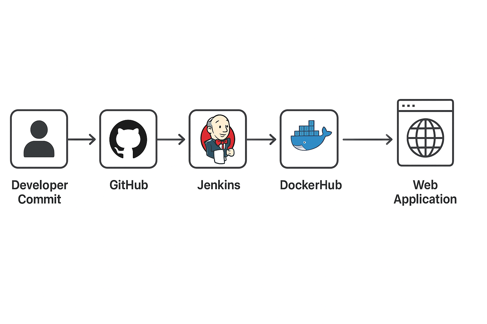
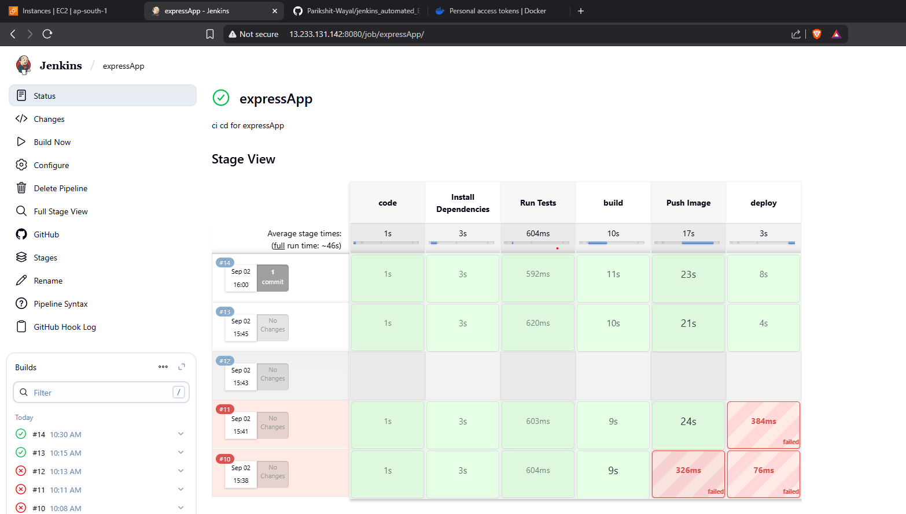
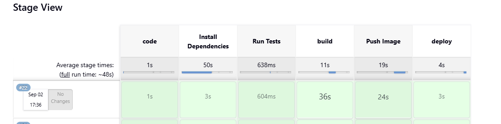

<table>
  <tr>
    <td></td>
    <td><h1 align="center">Jenkins Automated Pipeline for Node.js Express App<</h1></td>
  </tr>
</table>


## 📌 Project Overview
Earlier, while learning **Web Development**, I created a **Node.js + Express.js app** (live at 👉 [postwebapp.onrender.com](https://postwebapp.onrender.com)).  

As a **DevOps learner**, I extended this project by automating its build, test, and deployment process using **Jenkins** and **Docker**.  
    

To get started, I took reference from this [YouTube tutorial](https://www.youtube.com/watch?v=XaSdKR2fOU4) and then customized it for my own use case.  

This documentation explains the setup, pipeline stages, and workflow.

---

## ⚙️ Jenkins Setup
1. Installed and configured **Jenkins** on a server (accessible at `http://localhost:8080`).  
2. Logged in with credentials and set up Jenkins as the **Automation Server**.  
3. Created a new **Pipeline project** in Jenkins and linked it with my GitHub repo.  
4. Configured a **GitHub Webhook** so every commit triggers the pipeline automatically.

📸 *Suggested Screenshot*: Jenkins Dashboard after setup.  

---

## 🔗 Repository
Source Code Repo: [Jenkins Automated Express App](https://github.com/Parikshit-Wayal/jenkins_automated_ExpressApp)  

---

## 🛠️ Pipeline Stages
    


The pipeline was written in **Groovy syntax** inside `Jenkinsfile`.  
Below are the defined stages:

```
Developer Commit → GitHub → Jenkins → Docker Build → DockerHub → Deploy Container (Port 3006)
```

---

```groovy
pipeline {
    agent any
    
    stages {
        stage('Code') {
            steps {
                echo "Cloning code from repo"
                git url: "https://github.com/Parikshit-Wayal/jenkins_automated_ExpressApp.git", branch:"main"
            }
        }

        stage('Install Dependencies') {
            steps {
                echo 'Installing Node.js dependencies'
                sh 'npm install'
            }
        }

        stage('Run Tests') {
            steps {
                echo 'Running minimal tests'
                // Example: mocha/jest
                sh 'npm test'
            }
        }

        stage('Build') {
            steps {
                echo "Building Docker image for Express App"
                sh "docker build -t expressapp:latest ."
            }
        }

        stage('Push Image') {
            steps {
                script {
                    withCredentials([usernamePassword(credentialsId: 'dockerHubCred', usernameVariable: 'USER', passwordVariable: 'PASS')]) {
                        sh 'docker login -u $USER -p $PASS'
                        sh 'docker tag expressapp:latest parikshit1212/expressapp:latest'
                        sh 'docker push parikshit1212/expressapp:latest'
                    }
                }
            }
        }

        stage('Deploy') {
            steps {
                echo "Deploying container locally"
                sh 'docker run -d -p 3006:3006 --name expressapp expressapp:latest'
            }
        }
    }
}
```

---

Usually Jenkins follows a Master–Slave (Controller–Agent) architecture, but in my setup I handled both configuration & job execution on the same server to keep it simple for learning.

---

## 🔐 Credentials Management in Jenkins

One of the best features Jenkins provides is **Global Credentials Binding**.  
Instead of hardcoding sensitive information (like DockerHub username/password) inside the pipeline, I created credentials in Jenkins:
    

- **Type**: Username with password  
- **ID**: `dockerHubCred` (used inside Jenkinsfile)  

Then, I accessed them securely using:

```groovy
withCredentials([usernamePassword(credentialsId: 'dockerHubCred', usernameVariable: 'USER', passwordVariable: 'PASS')]) {
    sh 'docker login -u $USER -p $PASS'
    sh 'docker tag expressapp:latest parikshit1212/expressapp:latest'
    sh 'docker push parikshit1212/expressapp:latest'
}
```
---

## 🔌 Jenkins Plugins

Jenkins supports a wide range of plugins to extend functionality.  
In this project, I used the **Pipeline: Stage View Plugin**, which provides a clear and visual way to see each stage of the pipeline execution.  


📌 With this plugin, you can:  
- See **all stages** (Clone → Install Dependencies → Test → Build → Push → Deploy) in a visual timeline.  
    
- Identify **which stage failed** if there’s an error.  
- Track build history per stage.  

Example view with the plugin enabled:  
